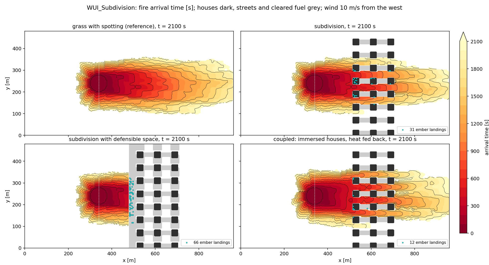

.. role:: cpp(code)
   :language: c++

.. _sec:WUIValidation:

WUI Validation Case
===================

``Exec/CanonicalTests/Fire/WUI_Subdivision`` is the case that exercises the
wildland-urban interface (WUI) features together, on a scenario built to be
checked: a wind-driven grass fire running from open wildland into three rows
of houses. There is no field dataset behind it. What it validates is each
piece of the coupled result against something independent: the head spread
rate against Rothermel's model, the structures against the rule that they
never burn, the subdivision against the delay a row of obstacles must impose,
defensible space against the exposure it must remove, embers against the
count that must land, and the fuel against conservation.

The scenario
------------

A 960 by 480 by 240 m domain at 10 m in the atmosphere and 5 m on the fire
grid, a neutral 10 m/s sounding entering at the west face and leaving at the
east face, periodic in y, a Smagorinsky closure and a MOST surface layer.
The fuel is Anderson model 1, short grass, at 6% moisture, ignited as a 40 m
disc at x = 340 m. Three rows of eight 20 m square, 8 m tall houses stand at
x = 520, 600 and 680 m. Each 60 m of y holds a house, a 20 m grass lane and a
20 m street; the streets run with the wind and block nothing, the lanes carry
the fire through the rows and the houses take a third of the width out of it.
The lanes and streets are 20 m because the immersed forcing blanks every
atmosphere cell that touches a house node, so a 10 m gap in the 10 m
atmosphere grid is a wall: with 10 m lanes the lowest-layer wind behind the
first row fell to a few centimetres per second and the coupled fire crawled
through the lanes at the no-wind rate. ``gen_wui.py`` draws
the heightmap (which the fire's structure mask and the immersed forcing share)
and the two fuel maps.

Five variants share one base deck:

- ``wildland``: uniform grass, no houses, no spotting. The reference for the
  spread rate and the fuel budget.
- ``wildland_spotting``: uniform grass with the seeded spotting of the
  subdivision variants. The reference for the delay through the subdivision,
  so that the houses are the only difference.
- ``subdivision``: the houses as non-burnable structures with the level set
  extrapolated into them, the streets non-burnable through the fuel map,
  per-structure exposure diagnostics and seeded Albini spotting. The
  atmosphere is not fed back.
- ``defensible``: the subdivision with a 30 m fuel break along the wildland
  edge and 10 m cleared around every house, which removes the lanes, so the
  front cannot reach a house by contact and only embers can.
- ``coupled``: the subdivision with the houses standing in the atmosphere as
  immersed-forcing buildings, the fire's wind read from the open columns
  beside them, lagged heat coupling with the additive source placed in the
  open part of each column.

The checks
----------

``check_wui.py`` reads the last fire plotfile of each variant, the exposure
CSVs and the logs, prints a table and fails on any of these:

1. **Spread rate.** The head rate of spread along the centreline between
   x = 400 and 470 m of the ``wildland`` run, from the arrival-time field,
   must lie within 15% of Rothermel's rate for fuel model 1 at 6% moisture and
   the midflame wind that the Andrews wind adjustment factor gives from the
   10 m/s wind at 6.1 m, capped at the model's 300 ft/min maximum effective
   wind for fine fuels. The reference is Rothermel (1972) written out in the
   check, independent of the code; it gives 0.2501 m/s where the model
   reports 0.2502. The 15% covers the level-set discretisation and the
   directional spread on the centreline.
2. **Fuel conservation.** The fuel consumed over the burned area of the
   ``wildland`` run equals the initial load over the burned area within 5%;
   cells the front reached in the last minute are still burning.
3. **Structures never burn.** No fire cell inside a footprint has a negative
   level set and none has lost fuel, in all three subdivision variants.
4. **The subdivision delays the front.** The ``subdivision`` fire reaches
   x = 780 m, beyond the last row, later than the ``wildland_spotting``
   fire does, and at least one house is reached by the front.
5. **Embers land.** At least one brand lands on a footprint in the
   ``subdivision`` run (the seed is fixed, so the count is reproducible).
6. **Defensible space works.** In the ``defensible`` run fewer houses are
   reached by the front and the maximum heat load at a house is lower than in
   the ``subdivision`` run.
7. **The coupled run stands up.** No NaN in the log, a plume (maximum
   vertical velocity above 0.5 m/s in the last atmosphere plotfile), and the
   fire reaches x = 780 m.

The exposure numbers are also reported against the threshold usually quoted
for the ignition of wood by radiation, about 20 kW/m² (Cohen 2004), as a
reading rather than a check: the model's fireline intensity per metre of front
is not a flux on a wall, and the wall energy balance that would turn it into
one is future work.

   Fire arrival time at 2100 s in four of the variants: grass with spotting,
   the subdivision, the subdivision with defensible space, and the coupled
   run with immersed houses and the heat fed back. Houses are dark, streets
   and cleared fuel grey, ember landings cyan; the wind is 10 m/s from the
   west.

What building it found
----------------------

The fire grid inherits the atmosphere's periodicity, and with the inflow and
outflow in x of this case nothing filled the level set's ghost cells beyond
the west and east faces, so the gradient stencil read uninitialised memory
there. With one box per rank the run happened to survive; with two boxes on
a rank the level set blew up at the inflow face on the third step. Every
fire-grid exchange now extrapolates the nearest interior value into the ghost
cells of a non-periodic face (``fire_fill_boundary`` in ``ERF_FireGrid.H``),
and five box layouts on one to four ranks give the same fire to roundoff.
Periodic cases are unchanged. The perimeter in the statistics CSV was counted
inside each box only, so it depended on the decomposition; it now reads a
ghost-filled copy of the arrival time and stops at the domain.

The level set also ran ahead of its own rate of spread: with ``fire_ros`` at
0.250 m/s everywhere the head moved at 0.250 m/s for the first hundred
metres and then at 0.29-0.45 m/s. The gradient norm took whichever one-sided
difference was larger in magnitude regardless of sign, which is not the
Godunov scheme; wherever the level set is convex ahead of the front the
downwind slope won and the update was anti-dissipative. Removing the
artificial viscosity brought the overshoot forward and a wider or more
frequent reinitialisation did nothing. The norm now uses the Osher-Sethian
choice for an expanding front (:ref:`sec:FirePropagation`), and the head
speed is 0.250 m/s on every 40 m segment. The scheme had been described as a
fifth-order WENO-Z reconstruction; that reconstruction was never called, and
the descriptions now say what the code does.

Running it
----------

.. code-block:: bash

   cd Exec/CanonicalTests/Fire/WUI_Subdivision
   MPIRUN="mpirun -np 2" ./run_wui.sh /path/to/erf_exec

The domain is two boxes, so at most two ranks. Each variant runs 2100 s, the
passive ones in about half an hour and the coupled one in about an hour. ``SKIP_RUN=1`` re-runs only the checks. The reference results are
in the README of the case.

References
----------

- Rothermel, R. C. (1972). A mathematical model for predicting fire spread in wildland fuels. USDA Forest Service Research Paper INT-115.
- Andrews, P. L. (2012). Modeling wind adjustment factor and midflame wind speed for Rothermel's surface fire spread model. USDA Forest Service General Technical Report RMRS-GTR-266.
- Albini, F. A. (1983). Potential spotting distance from wind-driven surface fires. USDA Forest Service Research Paper INT-309.
- Cohen, J. D. (2004). Relating flame radiation to home ignition using modeling and experimental crown fires. Canadian Journal of Forest Research, 34, 1616-1626.
- NFPA 1144 (2018). Standard for Reducing Structure Ignition Hazards from Wildland Fire. National Fire Protection Association.
